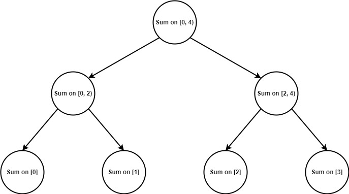

.. _Lazy_Initialization:

Lazy Initialization
==================

.. container:: section

   .. rubric:: Problem
      :class: sectiontitle

   Delay the creation of an object (potentially expensive) until it is accessed.
   In parallel programming initialization also must be guarded against race conditions.

.. container:: section

   .. rubric:: Context
      :class: sectiontitle

   The cost of operations that take place during the initialization
   of the object may be considerably high. In that case, the object
   should be initialized only when it is needed. Lazy initialization
   is the common tactic that allows implementing such approach.

.. container:: section

   .. rubric:: Solution
      :class: sectiontitle

   Using ``oneapi::tbb::collaborative_call_once`` with ``oneapi::tbb::collaborative_once_flag``
   helps to implement thread-safe lazy initialization for a user object.

   In addition, ``collaborative_call_once`` allows other thread blocked on
   the same ``collaborative_once_flag`` to join other |short_name|
   parallel constructions called within the intializing function.

.. container:: section

   .. rubric:: Example
      :class: sectiontitle

   The example presented here illustrate implementation "lazy initialization" for segment tree
   that stores information about the sum of each vector subinterval. Here is a graphical
   representation of the segment tree for vector of size 4.
   

   |image0|

   ``SumTree`` class represents a segment tree allowing to get the sum of a certain
   interval using ``GetSum(begin, end)`` method. A segment tree also includes an ``update``
   operation, but implementation was omitted in this example not to increase the size of
   the code. 
   
   
   Note that the tree is not initialized when the constructor is called, but at
   the first time the sum is queried.

   ::

      class SumTree {
         oneapi::tbb::collaborative_once_flag flag;
         const std::vector<int>& elems_ref;
         std::unique_ptr<Node> root = nullptr;

      public:
         explicit SumTree(const std::vector<int>& numbers) : elems_ref(numbers) {}

         size_t GetSum(size_t begin, size_t end) {
            // executed once, other threads will join if there is a parallel construction inside
            oneapi::tbb::collaborative_call_once(flag, [this] {
               root = std::unique_ptr<Node>(new Node(0, elems_ref.size(), elems_ref));
            });
            return root->GetSum(begin, end);
         }
      };

   Code for ``Node`` is shown below. Since the vector values are known beforehand,
   the sum for each node can be calculated while recursively descending through
   each child until reaching the leaves.

   ::

      struct Node {
         size_t begin;
         size_t end;
         size_t sum = 0;

         std::unique_ptr<Node> left_child = nullptr;
         std::unique_ptr<Node> right_child = nullptr;

         Node(size_t left, size_t right, const std::vector<int>& elems) : begin(left),
                                                                           end(right)
         {
            if (end-begin <= 1) {
               // We have reached the leaf. Just add a value to sum
               sum = elems[begin];
            } else {
               // Split the interval in two and recursively descend
               std::size_t mid = (begin + end) / 2;

               oneapi::tbb::parallel_invoke(
                  [this, mid, &elems] {
                     left_child = std::unique_ptr<Node>(new Node(begin, mid, elems));
                  },
                  [this, mid, &elems] {
                     right_child = std::unique_ptr<Node>(new Node(mid, end, elems));
                  }
               );
               
               sum = left_child->sum + right_child->sum;
            }
         };

         size_t GetSum(size_t left, size_t right) {
            size_t result_sum = 0;
            if (left <= begin && end <= right) {
               // We are inside the queried interval so just return the sum
               result_sum = sum;
            } else if (left_child && right_child) {
               result_sum = left_child->GetSum(left, right) + right_child->GetSum(left, right);
            }
            return result_sum;
         }
      };

   Here is an example of using ``SumTree`` in ``oneapi::tbb::parallel_for``.

   ::

      std::vector<int> values(N);
      // Fill the vector with some values
      SumTree tree(values);
      // Some amount of work before parallel_for

      oneapi::tbb::parallel_for(tbb::blocked_range<size_t>(0ull, N), [&tree] (auto r) {
         // Get the sum on interval. Threads that are blocked on the same flag can
         // share the work received from oneapi::tbb::parallel_invoke. 
         size_t sum = tree.GetSum(r.begin(), r.end());
         // Using the sum received further
      });

