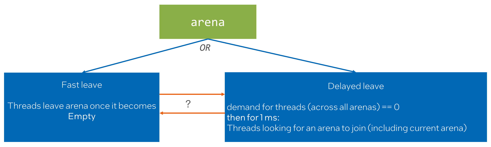
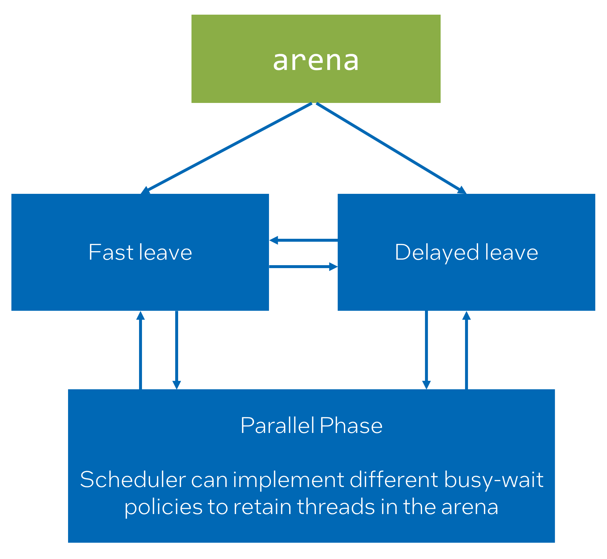

# Adding API for parallel block to task_arena to warm-up/retain/release worker threads

## Introduction

In oneTBB, there has never been an API that allows users to block worker threads within the arena.
This design choice was made to preserve the composability of the application.<br>
Since oneTBB is a dynamic runtime based on task stealing, threads migrate from one arena to
another while they have tasks to execute.<br>
Before PR#1352, workers moved to the thread pool to sleep once there were no arenas with active
demand. However, PR#1352 introduced a delayed leave behavior to the library that
results in blocking threads for an `implementation-defined` duration inside an arena
if there is no active demand arcoss all arenas. This change significantly
improved performance in cases where the application is run on high thread count systems.<br>
The main idea is that usually, after one parallel computation ends,
another will start after some time. The delayed leave behavior is a heuristic to utilize this,
covering most cases within `implementation-defined` duration.

However, the new behavior is not the perfect match for all the scenarios:
* The heuristic of delayed leave is unsuitable for the tasks that are submitted
  in unpredictable pattern and/or duration.
* If oneTBB is used in composable scenarios it is not behaving as
  a good citizen consuming CPU resources.
  * For example, if an application builds a pipeline where oneTBB is used for one stage
    and OpenMP is used for a subsequent stage, there is a chance that oneTBB workers will
    interfere with OpenMP threads. This interference might result in slight oversubscription,
    which in turn might lead to underperformance.

So there are two related problems but with different resolutions:
* Completely disable new behavior for scenarios where the heuristic of delayed leave is unsuitable.
* Optimize library behavior so customers can benefit from the heuristic of delayed leave but
  make it possible to indicate that "it is the time to release threads".

## Proposal

Let's tackle these problems one by one.

### Completely disable new behavior

Let’s consider both “Delayed leave” and “Fast leave” as 2 different states in state machine.<br>
* Therefore, workloads that knows that they cannot benefit from the heuristic of delayed leave
  but rather, it brings performance problems can create an arena in “Fast leave” state.
* And the opposite by default arena will be created in “Delayed leave” state because
  the delayed leave behavior is a heuristic that benefit most of the workloads.



There will be a question that we need to answer:
* Do we see any value if arena potentially can transition from one to another state?
  * What if different types of workloads are mixed in one application?
  * Different types of arenas can be used for different types of workloads.

### When threads should leave?

oneTBB itself can only guess when the ideal time to release threads from the arena is.
Therefore, it do the best effort to preserve and enhance performance without completely
messing composability guarantees (that is how delayed leave is implemented).

As we already discussed, there are cases where it does not work perfectly,
therefore customers that want to further optimize this
aspect of oneTBB behavior should be able to do it.

This problem can be considered from another angle. Essentially, if the user can indicate
where parallel computation ends, they can also indicate where it starts.


With this approach, the user not only releases threads when necessary but also specifies a
programmable block where worker threads should stick to the executing arena.

Let’s add new state to the existing state machine. To represent "Parallel Block" state.

> **_NOTE:_** The "Fast leave" state is colored Grey just for simplicity of the chart.
              Assume, that arena was created with the "Delayed leave" and the same logic
              is applicable to the "Fast leave".


This state diagram leads to several questions. There are some of them:
* What if there are multiple Parallel Blocks?
* If “End of Parallel Block” leads back to “Delayed leave” how soon threads
  will be released from arena?
  * What if we indicated that threads should leave arena after the "Parallel Block"?
  * What if we just indicated the end of the "Parallel Block"?

The extended state machine aims to answer these questions.
* The first call to the “Start of PB” will transition into the “Parallel Block” state.
* The last call to the “End of PB” will transition back to the “Delayed leave” state
  or into the "One-time Fast leave" if it is indicated that threads should leave sooner.
* Concurrent or nested calls to the “Start of PB” or the “End of PB”
  increment/decrement reference counter.


Let's consider the semantics that an API for explicit parallel blocks can provide:
* Start of a parallel block:  * Indicates the point from which the scheduler can use a hint and stick threads to the arena.
  * Serve as a warm-up hint to the scheduler, making some worker threads immediately available
    at the start of the real computation.
* "Parallel block" itself:
  * Scheduler can implement different policies to retain threads in the arena.
* End of a parallel block:
  * Indicates the point from which the scheduler can drop a hint and unstick threads from the arena.
  * Indicates that arena should enter the “One-time Fast leave” thus workers can leave sooner.


Start of a parallel block:<br>
The warm-up hint should have similar guarantees as `task_arena::enqueue` from a signal standpoint.
Users should expect the scheduler will do its best to make some threads available in the arena.

"Parallel block" itself:<br>
The semantic for retaining threads is a hint to the scheduler;
thus, no real guarantee is provided. The scheduler can ignore the hint and
move threads to another arena or to sleep if conditions are met.

End of a parallel block:<br>
Can indicate that arena should enter the “One-time Fast leave” thus workers can leave sooner.
However, if work was submitted immediately after the end of the parallel block,
the default arena "workers leave" state will be restored.
If the default "workers leave" state was the "Fast leave" the result is NOP.

```cpp
class task_arena {
    enum class workers_leave {
        fast,
        delayed
    };

    task_arena(const constraints& constraints_, unsigned reserved_for_masters = 1,
               priority a_priority = priority::normal,
               workers_leave a_workers_leave = workers_leave::delayed);

    void parallel_block_start();
    void parallel_block_end(bool set_one_time_fast_leave = false);
    scoped_parallel_block_type scoped_parallel_block(bool set_one_time_fast_leave = false);
};

namespace this_task_arena {
    void parallel_block_start();
    void parallel_block_end(bool set_one_time_fast_leave = false);
    scoped_parallel_block_type scoped_parallel_block(bool set_one_time_fast_leave = false);
}
```

By the contract, users should call `parallel block start` for each
subsequent call to `parallel block_end`.<br>
Let's introduce RAII scoped object that will help to manage the contract.

If the end of the parallel block is not indicated by the user, it will be done automatically when
the last public reference is removed from the arena (i.e., task_arena is destroyed or a thread
is joined for an implicit arena). This ensures correctness is
preserved (threads will not stick forever).

## Considerations

The alternative approaches were also considered.<br>
We can express this state machine as complete graph and provide low-level interface that
will give control over state transition.



We considered this approach too low-level. Plus, it leaves a question: "How to manage concurrent changes of the state?".

The retaining of worker threads should be implemented with care because
it might introduce performance problems if:
* Threads cannot migrate to another arena because they
  stick to the current arena.
* Compute resources are not homogeneous, e.g., the CPU is hybrid.
  Heavier involvement of less performant core types might result in artificial work
  imbalance in the arena.


## Open Questions in Design

Some open questions that remain:
* Are the suggested APIs sufficient?
* Are there additional use cases that should be considered that we missed in our analysis?
* Do we see any value if arena potentially can transition from one to another state?
  * What if different types of workloads are mixed in one application?
  * What if there concurrent calls to this API?
