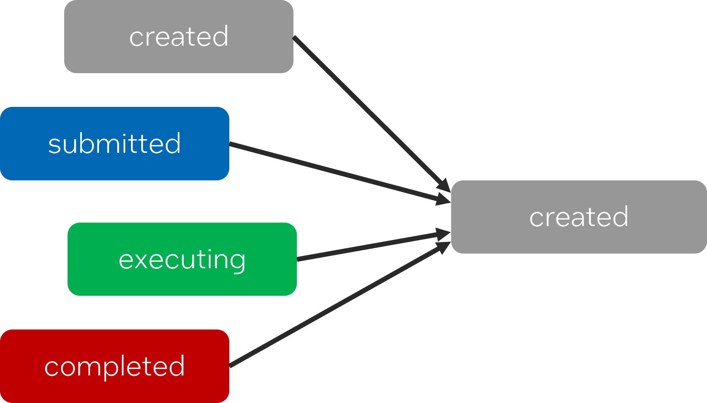

# Extending task_group to manage dynamic dependencies between tasks

## Introduction

Back in 2021, during the move from TBB 2020 to the first release of oneTBB, 
the lowest level tasking interface changed significantly and was no longer 
promoted as a user-facing feature. Instead, the guidance since then has been 
to use the `task_group` or the flow graph APIs to express patterns that were 
previously expressed using with the lowest level tasking API. And for most 
cases, this has been sufficient. However, there is one use case which is not 
straightforward to express by the revised API: Dynamic task graphs which are 
not trees. This proposal expands `tbb::task_group` to make additional use cases 
easier to express.

The class definition from section **[scheduler.task_group]** in the oneAPI 
Threading Building Blocks (oneTBB) Specification 1.3-rev-1 for `tbb::task_group` 
is shown below. Note the existing `defer` function because this function and 
its return type, `task_handle`, are the foundation of our proposed extensions:

    class task_group {
    public:
        task_group();
        task_group(task_group_context& context);

        ~task_group();

        template<typename Func>
        void run(Func&& f);

        template<typename Func>
        task_handle defer(Func&& f);

        void run(task_handle&& h);

        template<typename Func>
        task_group_status run_and_wait(const Func& f);

        task_group_status run_and_wait(task_handle&& h);

        task_group_status wait();
        void cancel();
    };

## Proposal

The following table summarizes the three primary extensions that are under 
consideration. The remainder of this post provides background and further 
clarification on these proposed extensions.

1. Extend semantics and useful lifetime of `task_handle`. We propose `task_handle` 
to represent tasks for the purpose of adding dependencies. The useful lifetime and 
semantics of `task_handle` will need to be extended to include tasks that have been 
submitted, are currently executing, or have been completed.
2. Add functions to set task dependencies. In the current `task_group`, tasks can 
only be waited for as a group and there is no direct way to add any before-after 
relationships between individual tasks. We will discuss options for spelling.
3. Add a function to move successors from a currently executing task to a new task. 
This functionality is necessary for recursively generated task graphs. This case 
represents a situation where it is safe to modify dependencies for an already 
submitted task. 

### Extend the semantics and useful lifetime of task_handle

Dynamic tasks graphs order the execution of tasks via dependencies on the 
completion of other tasks. They are dynamic because the creation of tasks, 
specification of dependencies between, submission of tasks for scheduling, and
execution of the tasks may happen concurrently and in various orders. Different
concrete use cases have different requirements on when new tasks are created 
and when dependencies between tasks are specified. 

For the sake of discussion, let’s label four points in a task’s lifetime: 

1. created
2. submitted
3. executing
4. completed

A created task has been allocated but is not yet known to the scheduling
algorithm and so cannot begin executing. A submitted task is known to the 
scheduling algorithm and whenever its incoming dependencies (predecessor tasks)
are complete it may be scheduled for execution. An executing task has started 
executing its body but is not yet complete. Finally, a completed task has
executed fully to completion.

In the current specification for `task_group`, the function `task_group::defer`
already provides a mechanism to separate task creation from submission. 
`task_group::defer` returns a `tbb::task_handle`, which represents a created 
task. A created task is in the created state until it is submitted via
the `task_group::run` or `task_group::run_and_wait` functions. In the current 
specification of `task_group`, accessing a `task_handle` after it is submitted
via one of the run functions is undefined behavior. Currently, therefore, a 
`task_handle` can only represent a created task. And currently, any task
that is run can immediately be scheduled for execution since there is no notion
of task dependencies for task_group.

The first extension is to expand the semantics and usable lifetime of
`task_handle` so that remains valid after it is passed to run and it can 
represent tasks in any state, including submitted, executing, and completed 
tasks. Similarly, a `task_handle` in the submitted state may represent a task
that has predecessors that must complete before it can execute, and so passing
a `task_handle` to `task_group::run` or `task_group::run_and_wait` only makes
it available for dependency tracking, and does not make it immediately legal to
execute.

### Add function(s) to set dependencies.

The obvious next extension is to add a mechanism for specifying dependencies
between tasks. In the most conservative view, it should only be legal to add 
additional predecessors / in-dependencies to tasks in the created state. 
After a task starts is completed, it doesn’t make sense to add additional 
predecessors, since it’s too late for them to delay the start of the task’s 
execution. 

It can make sense to add additional predecessors to a task that is
currently executing if the executing task is suspended until those 
additional dependencies complete. However, in this proposal we do not intend 
to support this suspension model. 

For a task in the submitted state, there can be a race between
adding a new predecessor and the scheduler deciding to execute the task when its 
currently known predecessors have completed. We will revisit the discussion of 
adding predecessors to submitted tasks in the next section when we discuss 
recursively grown task graphs. 

Having mostly settled the question about when a predecessors can be added,
then next question is what can be added as a predecessor task? The most 
user-friendly answer is to have no limitation; any valid `task_handle` can act as 
a predecessor. In many cases, a developer may only know what work must be completed 
before a task can start but does not know the state of that work.

We therefore think predecessors may be in any state when they are added, 
as shown below:

There are a number of possible options for the spelling of a function for adding 
a single predecessor. We may also want a function to allow adding multiple 
predecessors in one call.

Given two `task_handle` objects `h1` and `h2`, some possible options 
for adding `h1` as an in-dependence / predecessor of `h2` include:

- `h2.add_predecessor(h1)`
- `h2 = defer( { … }, h1)`
- `make_edge(h1, h2)`

We propose including the first option. Similarly, there could be
versions of these two functions the accepted multiple predecessors 
at once:

- `h.add_predecessors(h1, ..., hn)`

In the general case, it would be undefined behavior to add a new predecessor
to a task in the submitted, executing or completed states.

### Add a function for recursively grown graphs

A very common use case for oneTBB tasks is parallel recursive decomposition. 
The implementation of tbb::parallel_for is an example of an algorithm that 
performs a parallel recursive decomposition of the Range.  We currently 
implement the oneTBB algorithms, such as tbb::parallel_for, using the non-public,
low-level tasking API, not tbb::task_group. The current low-level tasking API
puts all the burden on developers for both dependence tracking and memory
management of tasks. This lets the TBB development team build highly optimized
algorithms, but we believe a simpler set of interfaces are possible for TBB 
users. Recursive parallel algorithms are one of the primary cases that we want 
our task_group extension to cover.

The key capability required for recursive decomposition is the ability to 
create work while executing a task and insert this newly created work before 
the (perhaps already submitted) successors of the currently executing task. 
As a simple example, consider a merge sort. As shown in the figure that 
follows, the top-level algorithm breaks a collection into two pieces and 
creates three tasks:

1. a task to sort the left half
2. a task to sort the right half
3. a task to merge the left and right sorted halves once they have been sorted. 

In a recursive merge sort, each of the sort tasks recursively takes the same 
approach to sort their portions of the collection. The top-level task (and 
subsequent recursively generated tasks) must be able to create new tasks 
and then update the graph so that their outer merge task waits for the 
newly created subtasks to complete.

A key point about this recursive parallel algorithm is that we must change 
the predecessors of the merge tasks. But the merge tasks are already 
submitted at the time their predecessors are modified! In the previous 
section, we noted that updating the predecessors of a submitted task is 
risky, because there is a potential race.  However, in the example shown 
here, we know it’s safe to add additional predecessors to the merge task 
because it simply cannot start executing until all its current predecessors 
complete, and its predecessors are the tasks modifying the predecessors! 

We therefore propose a very limited extension that allows the transfer of 
all the successors of a currently executing task to become the successors 
of a different created task. This function can only access the successors
of the currently executing task, and those tasks are prevented from executing 
by a dependence on the current task itself, so we can ensure that we can safely 
update the incoming dependencies for those tasks without worrying about any 
potential race.

One possible spelling for this function would be `transfer_successors_to(h)`, 
where `h` is a `task_handle` to a created task and the 
`transfer_successors_to` function must be called from within a task. Calling
this function from outside a task, or passing anything other than a task in
the created state is undefined behavior.

### Proposed changes to task_handle

    namespace oneapi {
    namespace tbb {
        class task_handle {
        public:

            // existing functions
            task_handle();
            task_handle(task_handle&& src);
            ~task_handle();
            task_handle& operator=(task_handle&& th);
            explicit operator bool() const noexcept;

            // proposed additions
            void add_predecessor(task_handle& th);
            void add_successor(task_handle& th);
        };

        void transfer_successors_to(task_handle& th);
    }
    }

#### void task_handle::add_predecessor(task_handle& th);

Adds `th` as a predecessor that must complete before the task represnted by
`*this` can start executing.

#### void task_handle::add_successor(task_handle& th);

Adds `th` as a successor that cannot start executing until the task represented by 
`*this` is complete.

#### void transfer_successors_to(task_handle& th);

Transfers all of the successors from the currently executing task to the task 
represented by `th`.

### Small examples

##### A simple three task graph

The example below shows a very simple graph with three nodes. The 
`final_task` must wait for both the `first_task` and `second_task` 
to complete.

    tbb::task_group tg;

    tbb::task_handle first_task = tg.defer([&] { /* task body */ });
    tbb::task_handle second_task = tg.defer([&] { /* task body */ });
    tbb::task_handle final_task = tg.defer([&] { /* task body */ });

    final_task.add_predecessor(first_task);
    final_task.add_predecessor(second_task);
    // optionally: final_task.add_predecessors(first_task, second_task);

    // order of submission is not important
    tg.run(final_task);
    tg.run(first_task);
    tg.run(second_task);

    tg.wait();

The dependency graph for this example is:

#### Adding predecessors in unknown states

The example below shows a graph where the dependencies are determined 
dynamically. The state of the predecessors may be unknown – they may 
be created, submitted, executing or completed. Although not shown,
let's assume that the user's `users::find_predecessors` function 
returns, based on application logic, the tasks that must complete 
before the new work can start.

    void add_another_task(tbb::task_group& tg, int work_id) {
        tbb::task_handle new_task = tg.defer([=] { do_work(work_id); });

        for (tbb::task_handle& p : users::find_predecessors(work_id)) {
            new_task.add_predecessor(p);
        }

        tg.run(new_task);
    }

Again, the graph, as shown below, is simple. However, now we do not 
know the completion status of the predecessors. Therefore, 
for ease-of-use, a `task_handle` should be usable as a dependency 
regardless of state of the task it represents. Any predecessor 
that is already completed when it is added as a predecessor will 
not delay the start of the dependent task. Otherwise, end-users 
will need to track these states explicitly.

#### And example of recursive decomposition

This example is a version of merge-sort (with many of the details left out). 
Assume that there is an initial task that executes the function shown 
below as its body, and the function implements that task, and also serves 
as the body for the recursively decomposed pieces. The beginning and
end of the sequence are represented by `b` and `e`, and much of the
(unimportant) details of the implementation of merge-sort is hidden 
behind the functions `users::do_serial_sort`, `users::create_left_range`,
`users::create_right_range`, and `users::do_merge`.  

    template<typename T>
    void merge_sort(tbb::task_group& tg, T b, T e) {
        if (users::range_is_too_small(b, e)) {
            // base-case when range is small
            users::do_serial_sort(b, e);
        } else {
            // calculate left and right ranges
            T lb, le, rb, re;
            users::create_left_range(lb, le, b, e);
            users::create_right_range(rb, re, b, e);

            // create the three tasks
            tbb::task_handle sortleft =
                tg.defer([lb, le, &tg] {
                    merge_sort(tg, lb, le);
                });
            tbb::task_handle sortright =
                tg.defer([rb, re, &tg] {
                    merge_sort(tg, rb, re);
                });
            tbb::task_handle merge =
            tg.defer([rb, re, &tg] {
                    users::do_merge(tg, lb, le, rb, re);
                });

            // add predecessors for new merge task
            merge.add_predecessors(sortleft, sortright);

            // insert new subgraph between currently executing
            // task and its successors
            tbb::transfer_successors_to(merge);

            tg.run(sortleft);
            tg.run(sortright);
            tg.run(merge);
        }
    }

The task tree for this example matches the one shown earlier for merge-sort. 

## Open Questions in Design

Some open questions that remain:

- Are the suggested APIs sufficient?
- Are there additional use cases that should be considered that we missed in our analysis?
- Are there other parts of the pre-oneTBB tasking API that developers have struggled to find a good alternative for?
